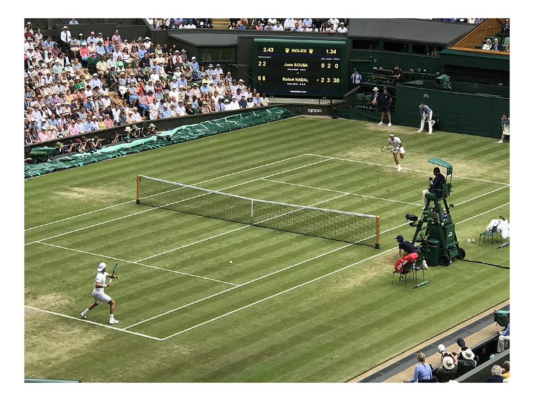
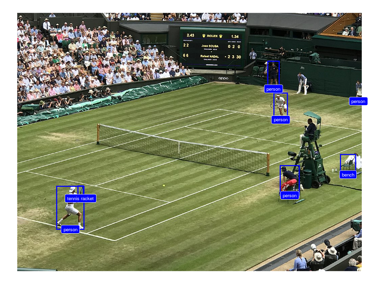

<!-- README.md is generated from README.Rmd. Please edit that file -->

# opensportml

<!-- badges: start -->

[](https://www.tidyverse.org/lifecycle/#experimental)
<!-- badges: end -->

## Installation

``` r
## install.packages("remotes")
remotes::install_github("openvolley/opensportml")
```

The `opensportml` package provides image and video machine learning
tools for sports analytics. Many of its functions are re-exported from
the [openvolley/ovml](https://github.com/openvolley/ovml) and
[openvolley/ovideo](https://github.com/openvolley/ovideo) packages,
which provide similar functionality but specifically for volleyball.

Currently two versions of the [YOLO](https://pjreddie.com/darknet/yolo/)
object detection algorithm are included. These have been implemented on
top of the [torch](https://torch.mlverse.org/) R package, meaning that
no Python installation is required on your system.

## Example

Use a YOLOv4 network to recognize objects in an image. We use an example
image bundled with the package:

``` r
library(opensportml)
img <- os_example_image()
ovml_ggplot(img)
```



Construct the network. The first time this function is run, it will
download and cache the network weights file (\~250MB).

``` r
dn <- ovml_yolo()
```

Now we can use the network to detect objects in our image:

``` r
dets <- ovml_yolo_detect(dn, img)
ovml_ggplot(img, dets)
```



We can transform the image detections to real-world court coordinates.
First we need to define the court reference points needed for the
transformation. We can use the `os_shiny_court_ref` helper app for this:

``` r
ref <- os_shiny_court_ref(img)
```


`ref` should look something like:

``` r
ref
#> $video_width
#> [1] 1024
#> 
#> $video_height
#> [1] 768
#> 
#> $court_ref
#> # A tibble: 4 x 4
#>   image_x image_y court_x court_y
#>     <dbl>   <dbl>   <dbl>   <dbl>
#> 1  0.0256   0.386    12.5      46
#> 2  0.283    0.117   100         0
#> 3  0.867    0.475    87.5     154
#> 4  0.582    0.626     0       200
```

Now use it with the `ov_transform_points` function (note that currently
this function expects the image coordinates to be normalized with
respect to the image width and height):

``` r
court_xy <- ov_transform_points(x = (dets$xmin + dets$xmax)/2/ref$video_width, y = dets$ymin/ref$video_height,
                                ref = ref$court_ref, direction = "to_court")
dets <- cbind(dets, court_xy)
```

And plot it:

``` r
library(ggplot2)
ggplot(dets, aes(x, y)) + os_ggcourt() + geom_point()
```


Keep in mind that `ov_transform_points` is using the middle-bottom of
each bounding box and transforming it assuming that this represents a
point on the court surface (the floor). Locations associated with
truncated object boxes, or objects not on the court surface (a tennis
racket in a player’s hand, players jumping, people in elevated positions
such as the referee’s stand) will appear further away from the camera
than they actually are.
